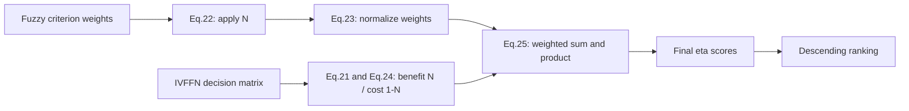

# IVFF-MADM-Reproduction

## Paper

**A new multi-attribute decision making approach based on new score function and
hybrid weighted score measure in interval-valued Fermatean fuzzy environment**

Hongwu Qin, Qiangwei Peng, Xiuqin Ma, Jianming Zhan. *Complex & Intelligent
Systems* (2023), **9:5359-5376**. DOI:
[10.1007/s40747-023-01021-7](https://doi.org/10.1007/s40747-023-01021-7).

[Supplied PDF](paper/s40747-023-01021-7.pdf) ·
[Source provenance and baseline reference](paper/SOURCES.md).

## Goal

Numerical reproduction of the proposed IVFF-MADM method, extended to an audit of
Examples 1-10, Cases 1-3, Tables 1-5 and the numerical comparisons in Figures 2-3.
Intermediate values are checked before interpreting rankings. No machine learning
or training is used.

**The audit is implemented; the paper is not fully numerically reproduced.**
Case 2 matches all requested full-precision checkpoints at absolute tolerance
`1e-4`. Other sections contain discrepancies or undefined baseline branches.
Every such outcome remains visible; none is silently corrected or marked PASS.
The earlier Example 3 stop gate was superseded by the user's instruction to
execute the full audit plan after documenting discrepancies.

## Run

Python 3.11+; standard library for all mathematical computations, `pytest` for
tests. Plotting is an optional extra; NumPy is only a transitive dependency of
matplotlib and is not used by the algorithms.

```powershell
python -m venv .venv
.\.venv\Scripts\python.exe -m pip install -r requirements.txt
.\.venv\Scripts\python.exe reproduce.py

# Optional publication/export artifacts:
.\.venv\Scripts\python.exe -m pip install -r requirements-plots.txt
.\.venv\Scripts\python.exe reproduce.py --plots

# One report section; use another output directory to preserve the full report:
.\.venv\Scripts\python.exe reproduce.py --section "Case 2" --output-dir reports/case2

# Mathematical correctness / validation tests:
.\.venv\Scripts\python.exe -m pytest -m "not paper" -q

# Strict paper checkpoints, including real mismatches:
.\.venv\Scripts\python.exe -m pytest -m paper -q
.\.venv\Scripts\python.exe -m pytest -q
```

Full audit exit code is **1** while any mismatch or source ambiguity exists.
Case 2 alone exits **0**. All sections run before an exit code is returned.
The optional PDF-reading packages used during development are not runtime
requirements. No network access is needed to run the audit.

## Method

IVFFN → proposed score function → crisp weights → normalized weights → score
matrix → Hybrid Weighted Model → ranking.



This maps the algorithm diagram in Fig.1; Fig.1 is not a numerical experiment.

```text
N(tau) = (mu_L^3 + mu_U^3
          + mu_L * cbrt(1 - nu_L^3)
          + mu_U * cbrt(1 - nu_U^3)) / 2
crisp_j = N(psi_j)
w_j = crisp_j / sum(crisp)
sigma_ij = N(chi_ij) for BENEFIT, 1 - N(chi_ij) for COST
WSM_i = sum_j(w_j * sigma_ij)
WPM_i = product_j(w_j * sigma_ij)
eta_i = theta * WSM_i + (1 - theta) * WPM_i
```

The product is the product of weighted scores, not a product of exponentiated
scores. Internal calculations preserve Python float precision. IVFFN validation
uses `1e-12` tolerance for the computed cubic constraint; interval bounds and
ordering remain strict. Negative cost scores are preserved. Normalized weights
must sum to one within `1e-12` in the primary HWM implementation.

`MADMResult.ranking` contains zero-based indices. Baseline reports also retain
explicit tie groups (absolute tie tolerance `1e-12`, input order within ties).

## Paper → Code Mapping

| Definition / Equation | Source |
|---|---|
| IVFFN datatype and validation | [src/ivffn.py](src/ivffn.py) |
| Eq.21 score function | [src/score.py](src/score.py) |
| Eq.22 crisp weight | [src/weights.py](src/weights.py) |
| Eq.23 normalize weight | [src/weights.py](src/weights.py) |
| Eq.24 score matrix / Steps 1-5 pipeline | [src/madm.py](src/madm.py) |
| Eq.25 HWM | [src/hwm.py](src/hwm.py) |
| Eqs.1-6, six comparison scores | [src/comparison_scores.py](src/comparison_scores.py) |
| Eqs.7-10 Chen-Tsai; literal-index diagnostic | [src/baselines.py](src/baselines.py) |
| Eqs.11-20 Rani literal trace and reference52 interpretation | [src/baselines.py](src/baselines.py) |
| Examples 3-4 / Cases 1-3, Tables 1-3 inputs | [data/](data/) |
| Examples 5-10 / Table 4 references | [data/score_examples.py](data/score_examples.py) |
| Examples 1-2, Eqs.26-28, Tables 4-5, numerical audit | [src/audit.py](src/audit.py) |
| Figures 2-3 | [src/plots.py](src/plots.py) |
| CLI and CSV/JSON/Markdown export | [reproduce.py](reproduce.py) |

Examples 1/3 share the same decision matrix and weights. Example 2 uses the same
matrix as Example 4; Rani calculates CRITIC weights rather than using fuzzy
criterion weights. Those inputs are intentionally reused instead of duplicated.

## Reproduction Results

Selected checkpoints below use the full-precision pipeline. The generated
[complete report](reports/reproduction.md) includes every matrix cell, weight,
WSM/WPM component, final score and ranking. WSM/WPM references are explicitly
**derived from printed intermediates**, not claimed as independently published.

| Checkpoint | Paper | Code | Abs Error | Status |
|---|---:|---:|---:|---|
| Example 3 eta2 | .0301 | .029630491973 | .000469508027 | FAIL |
| Example 4 sigma11 | .3114 | .331371548905 | .019971548905 | FAIL |
| Example 4 eta1 | .1581 | .165139414754 | .007039414754 | FAIL |
| Case 1 sigma54 (COST) | .7523 | .725606029971 | .026693970029 | FAIL |
| Case 1 eta5 | .3486 | .347805540154 | .000794459846 | FAIL |
| Case 2 eta1 | .0511 | .051113890698 | .000013890698 | PASS |
| Case 2 eta2 | .0542 | .054229087125 | .000029087125 | PASS |
| Case 2 eta3 | .0251 | .025100630818 | .000000630818 | PASS |
| Case 3 Step 4 eta1 | .0528 | .219287859325 | .166487859325 | FAIL |
| Case 3 Step 5 eta3 | .1520 | .155961651201 | .003961651201 | FAIL |
| Example 6 H(alpha3) | 1.100 | .550000000000 | .550000000000 | FAIL |

| Proposed-method dataset | Full-precision checkpoint results | Actual ranking |
|---|---|---|
| Example 3 | 14 PASS, 1 FAIL | p1 > p2 |
| Example 4 | 11 PASS, 4 FAIL | p2 > p1 |
| Case 1 | 40 PASS, 4 FAIL | p1 > p4 > p3 > p2 > p5 |
| Case 2 | 25 PASS | p2 > p1 > p3 |
| Case 3 | 23 PASS, 6 FAIL, including conflicting Step 5/Output claims | p1 > p3 > p2 |

Maximum absolute error across the proposed-method full-precision checkpoints is
**.166487859325**, from Case 3 Step 4 eta1. Within Case 1 it is **.026693970029**.
Among comparison-score examples the largest is **.55**. Percent metrics use
different units, so they are not mixed into a single score-error maximum.

Case 1's fourth failed check is derived WSM1: printed rounded values give
.83233525 versus .832230141007 (error .000105108993). This small rounding
accumulation is distinct from the much larger sigma54 discrepancy.

### Precision modes

- **Full:** original data, no intermediate rounding; primary implementation.
- **Rounded diagnostic:** round each completed crisp/normalized/matrix stage to
  four decimals, then evaluate HWM without further rounding or re-normalization.
- **Printed-intermediate diagnostic:** evaluate HWM using paper's displayed matrix
  and weights to identify propagation of an incorrect intermediate value.

All modes are recorded separately. Strict comparisons remain at `1e-4`. For
three-decimal examples a supplementary source-precision comparison uses `.0005`;
for integer percentages it uses `.5` percentage point. No test tolerance is
silently broadened to conceal a discrepancy.

### Comparison artifacts

- [Markdown checkpoint report](reports/reproduction.md)
- [CSV checkpoint report](reports/checkpoints.csv)
- [JSON checks and complete intermediate traces](reports/audit.json)
- [Fig.2: differentiation-rate audit](reports/figure2-dr.png) / [SVG](reports/figure2-dr.svg)
- [Fig.3: recognition-index audit](reports/figure3-ri.png) / [SVG](reports/figure3-ri.svg)

Table 4 has two incorrect Y entries: M and P both tie alpha9/alpha10. Their DR
is 4/6=66.6667%, versus printed 83%. H, C and R yield 83.3333%, G 50%, and N 100%.
Fig.3 preserves an unknown marker for the unspecified Rani no-cost branch rather
than plotting a fabricated result. Table 5 has five rows but its prose computes
2/4; its printed Y/N entries actually give 2/5=40% if all rows count.

## Known Issues / Ambiguities

See [DISCREPANCIES.md](DISCREPANCIES.md) for source pages, complete explanations
and all interpretation choices. The most important issues are:

- Example 3 substitutes `.5667` for `.5567` only for p2.
- Example 4 and Case 1 contain intermediate values inconsistent with Eq.21/24.
- Case 3 gives conflicting final scores and rankings in three places.
- Eq.25 uses crisp-weight notation while describing normalized weights.
- Chen's Eq.10 sum starts at `j=i`; its worked example sums all criteria instead.
- Rani's reproduced CRITIC equations have misplaced denominators/powers and a
  circular weight definition. Literal execution fails before aggregation.
- The separately named reference52 branch uses verified original formulas, but
  still requires explicit sum-bound and subgroup interpretations. No-cost input
  is undefined in the printed COPRAS expression; it remains UNRESOLVED.
- Case 1's reference52 relative scores are negative; Eq.20's division reverses
  their ordering. Neither order confirms the claimed baseline ranking.
- Table 5 example labels and ER denominator are ambiguous.

The audit covers all numerical sections. Eight dependent baseline/metric checks
remain UNRESOLVED because the sources do not define a unique evaluable result.
There are no deferred data placeholders. This is not a claim of exact numerical
reproduction or of universal superiority of the proposed score.

## Tests

Tests include datatype validation, formula boundaries, cost conversion, dimensions,
HWM endpoints, ranking/ties, CRITIC hand calculations, Einstein idempotence,
COPRAS hand calculations, denominator failures, and an independent **60-digit
Decimal** score oracle for all proposed-case input cells and weights.

The `paper` marker separates strict publication comparisons from mathematical
correctness tests. Real discrepancies fail; unresolved source claims are skipped
with explicit reasons, never counted as reproduced.

Current results:

- Mathematical correctness/validation: **140 passed**.
- Full suite: **351 passed, 48 failed, 8 skipped**.
- Audit report, including rounded diagnostics: **326 PASS, 61 FAIL, 8 UNRESOLVED**.

Tests and audit counts differ because the audit also includes both precision
modes, whereas the test suite additionally includes unit tests and a Decimal oracle.
Some strict failures are compatible with the source's displayed precision; consult
the separate source-precision column rather than interpreting every failure as an
algorithm defect.

See [coverage plan](REPRODUCTION_PLAN.md) and [pytest output](reports/pytest.txt).
